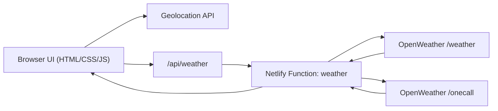

# Weather Forecast

A lightweight 3-day weather forecast app with a secure weather proxy and Netlify Function deployment support.

## Features

- Uses browser geolocation to fetch local weather
- Shows today, tomorrow, and day-after-tomorrow forecast
- Toggle between Celsius and Fahrenheit per metric
- Light and dark themes with saved preference
- Server-side weather proxy (API key stays in environment variables)
- Netlify Function for production deployment
- Automated tests + GitHub Actions CI

## Architecture



For local development, `/api/weather` is served by Express. In Netlify production, `netlify.toml` redirects `/api/weather` to `/.netlify/functions/weather`.

## Run locally

1. Install dependencies:

```bash
npm install
```

2. Create `.env` and set your key:

```bash
cp .env.example .env
```

3. Start the app:

```bash
npm start
```

4. Open [http://localhost:3000](http://localhost:3000).

## Netlify deployment

Use these settings in Netlify:

- Branch to deploy: `main`
- Base directory: *(empty)*
- Build command: `npm ci`
- Publish directory: `.`
- Functions directory: `netlify/functions`

Add this environment variable in Netlify project settings:

- `OPENWEATHER_API_KEY`

`netlify.toml` routes `/api/weather` to the Netlify function automatically.

## Scripts

- `npm start` - run local Express server
- `npm test` - run tests once
- `npm run test:watch` - run tests in watch mode

## Security note

The OpenWeather API key is no longer embedded in frontend code.

## Project structure

- `index.html` - UI markup
- `scripts/app.js` - frontend weather rendering logic
- `scripts/switcher.js` - theme toggling logic
- `style/*.css` - base and theme styles
- `src/weather-service.js` - shared weather validation/fetch logic
- `src/server.js` - local Express weather proxy endpoint
- `src/index.js` - local server entrypoint
- `netlify/functions/weather.js` - production Netlify Function
- `tests/server.test.mjs` - backend handler tests
- `tests/netlify-function.test.mjs` - Netlify function tests
- `.github/workflows/ci.yml` - CI pipeline
